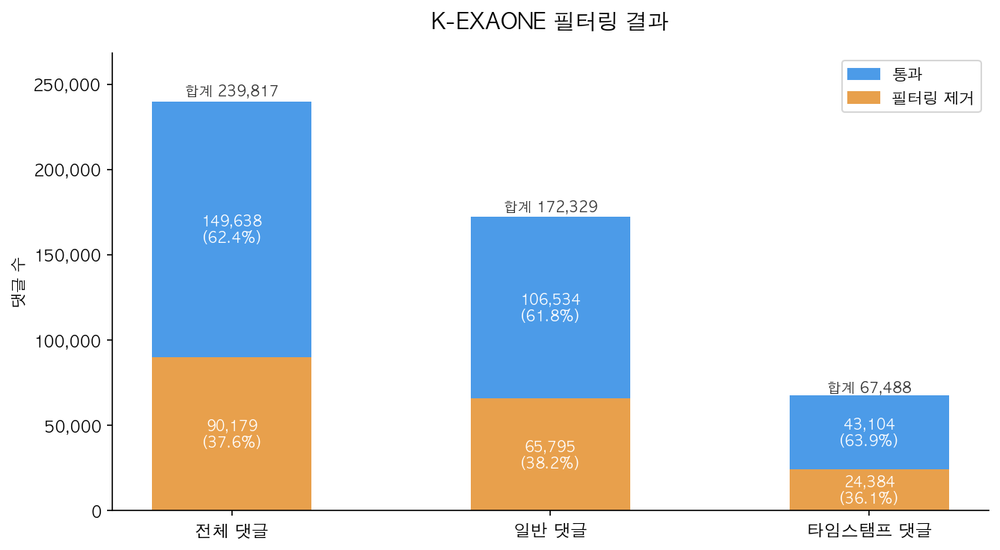
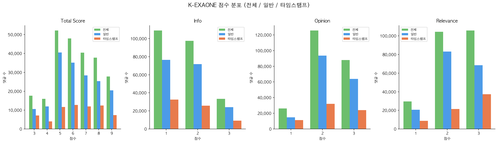

# k-exaone_filtering

K-EXAONE API(Elice mlapi.run)를 이용해 유튜브 영상의 댓글을 품질 기준으로 필터링하는 프로젝트입니다.

---

## 프로젝트 구조

```
k-exaone_filtering/
├── filter_comments_with_kexaone.py   # 댓글 필터링 메인 스크립트
├── configs/
│   └── kexaone.yaml                  # API 엔드포인트 + generation config
├── scripts/
│   └── run_filter_kexaone.sh         # 필터링 실행 셸 스크립트
├── data/
│   └── combined_data_merged.jsonl    # 입력 파일 (직접 복사해서 사용)
├── .env.example                      # API 키 환경변수 템플릿
└── requirements.txt                  # Python 의존성
```

---

## 동작 방식

각 영상의 트랜스크립트 + 댓글 목록을 K-EXAONE에 보내 아래 3가지 기준으로 각 댓글을 1~3점 채점합니다.

| 기준 | 설명 |
|------|------|
| 정보성 | 영상 관련 유의미한 정보나 요약을 담고 있는가 |
| 의견성 | 시청자의 감정·주관적 의견이 드러나는가 |
| 연관성 | 트랜스크립트의 특정 발언·장면과 직접 연관되는가 |

**총점 ≥ 6점** 댓글만 Pass로 분류합니다.

### API 호출 방식

`requests` 라이브러리로 Elice mlapi.run 엔드포인트에 직접 POST합니다. `summarize_with_kexaone.py`와 동일한 방식입니다.

```python
requests.post(
    url,
    headers={"Authorization": f"Bearer {api_key}", ...},
    json=payload,
    timeout=300,
)
```

generation 설정(`temperature`, `top_p`, `max_tokens`, `presence_penalty`, `chat_template_kwargs`)은 모두 `configs/kexaone.yaml`에서 관리되며, 환경변수로 개별 override 가능합니다.

---

## 입력 데이터

`data/` 폴더에 입력 파일을 복사합니다. (자기 할당 받은 필터링 대상 데이터 jsonl 파일)

```bash
cp /path/to/combined_data_merged.jsonl data/
```

입력 JSONL의 각 레코드에 필요한 필드:

| 필드 | 설명 |
|------|------|
| `video_url` | 유튜브 영상 URL (중복 처리 기준) |
| `video_id` | 유튜브 영상 ID |
| `title` | 영상 제목 |
| `success` | 수집 성공 여부 (`false`면 스킵) |
| `transcript` | 자막 세그먼트 리스트 (`[{"text": "..."}]`) |
| `regular_comments` | 일반 댓글 리스트 (`[{"text": "..."}]`) |
| `timestamp_comments` | 타임스탬프 댓글 리스트 (`[{"text": "..."}]`) |

---

## API 키 발급 방법

1. [Elice](https://elice.io) 회원가입
2. 홈 화면에서 **기관 만들기** 후 결제 수단 등록
3. 홈에서 **serverless 모델 탐색하기** 클릭
4. Text Generation 모델 목록에서 **K EXAONE** 클릭
5. **모델 사용하기** (보라색 버튼) 클릭 → **Serverless** 선택
6. **API Key 발급하기** 클릭 후 키 복사
7. 프로젝트 루트의 `.env` 파일에 아래와 같이 입력

```
K_EXAONE_API_KEY=발급받은_키_붙여넣기
```

---

## 실행 방법

#### 1. 환경 설정 (최초 1회)

```bash
conda create -n kexaone_filter python=3.11 -y
conda activate kexaone_filter
pip install -r requirements.txt
```

#### 2. API 키 설정

```bash
cp .env.example .env
# .env 파일에 K_EXAONE_API_KEY=your_bearer_token 입력 후 저장
```

#### 3. 실행

```bash
conda activate kexaone_filter
bash scripts/run_filter_kexaone.sh
```

환경변수로 직접 지정할 수도 있습니다:

```bash
export K_EXAONE_API_KEY=your_bearer_token
bash scripts/run_filter_kexaone.sh
```

출력 파일: `data/filtered_comments_kexaone.jsonl`

### 환경 변수

| 변수 | 기본값 | 설명 |
|------|--------|------|
| `K_EXAONE_API_KEY` | (필수) | Elice K-EXAONE Bearer 토큰 |
| `KEXAONE_CONFIG` | `configs/kexaone.yaml` | generation config 경로 |
| `INPUT_FILE` | `data/combined_data_merged.jsonl` | 입력 파일 경로 |
| `OUTPUT_FILE` | `data/filtered_comments_kexaone.jsonl` | 출력 파일 경로 |
| `TEMPERATURE` | YAML의 `generation.temperature` | 샘플링 온도 (override) |
| `TOP_P` | YAML의 `generation.top_p` | top-p 값 (override) |
| `MAX_TOKENS` | YAML의 `generation.max_tokens` | 최대 토큰 수 (override) |

---

## 출력

### 경로

```
data/filtered_comments_kexaone.jsonl
```

### 포맷

JSONL 형식으로 영상 1개당 1줄씩 저장됩니다.

```json
{
  "video_url": "https://www.youtube.com/watch?v=abc123",
  "video_id": "abc123",
  "title": "영상 제목",
  "evaluation_result": {
    "general_comments": [
      {
        "id": "g0",
        "scores": {"info": 3, "opinion": 2, "relevance": 3},
        "total_score": 8,
        "is_pass": true
      }
    ],
    "timestamp_comments": [
      {
        "id": "t0",
        "scores": {"info": 1, "opinion": 1, "relevance": 1},
        "total_score": 3,
        "is_pass": false
      }
    ]
  }
}
```

---

## 현재 필터링 현황

> 마지막 업데이트: 2026-04-23 · 평가 완료 영상 1,784개 기준

### 통과 / 제거 비율



| 구분 | 전체 | 통과 | 제거 |
|---|---|---|---|
| 전체 댓글 | 239,817 | 149,638 (62.4%) | 90,179 (37.6%) |
| 일반 댓글 | 172,329 | 106,534 (61.8%) | 65,795 (38.2%) |
| 타임스탬프 댓글 | 67,488 | 43,104 (63.9%) | 24,384 (36.1%) |

### 점수 분포 (total\_score · info · opinion · relevance)



| 지표 | 전체 평균 | 일반 평균 | 타임스탬프 평균 |
|---|---|---|---|
| Total Score | 6.26 | 6.26 | 6.26 |
| Info | 1.69 | 1.70 | 1.66 |
| Opinion | 2.26 | 2.28 | 2.19 |
| Relevance | 2.32 | 2.28 | 2.42 |

차트는 `visualize-filtering-result` 스킬로 재생성할 수 있습니다.

---

## 댓글 수 검증 (compare-comment-counts)

필터링 결과(`filtered_comments_kexaone_kkp.jsonl`)의 video_url별 댓글 수가 원본 데이터(`combined_data_no_overlap_merged.jsonl`)와 일치하는지 검증하는 도구입니다.

### 실행

```bash
python3 .claude/skills/compare-comment-counts/compare_comment_counts.py
```

### 비교 기준

| filtered 파일 필드 | combined 파일 필드 |
|---|---|
| `evaluation_result.general_comments` (len) | `regular_comments` (len) |
| `evaluation_result.timestamp_comments` (len) | `timestamp_comments` (len) |

### 불일치 로그 (`data/mismatch_log.json`)

실행할 때마다 불일치 항목을 `data/mismatch_log.json`에 누적 기록합니다.

- **신규 불일치** url → 추가 (`first_seen`, `last_seen` = 실행 날짜)
- **기존 불일치** url이 이번에도 불일치 → `last_seen` 및 수치 갱신
- **해소된** url (이번에 일치로 바뀜) → 로그에서 삭제

로그에 있는 url은 모두 현재 불일치 중인 항목입니다.

---

## 필터링 결과 시각화 (visualize-filtering-result)

필터링 결과 및 점수 분포를 전체·일반·타임스탬프 댓글 기준으로 시각화하는 도구입니다.

### 실행

```bash
python3 .claude/skills/visualize-filtering-result/visualize_filtering_result.py
```

### 출력

| 항목 | 내용 |
|---|---|
| 콘솔 | 필터링 통과·제거 수 및 지표별 평균/최솟값/최댓값 요약 |
| `assets/filtering_result.png` | 통과/제거 누적 막대 차트 |
| `assets/score_distribution.png` | total\_score·info·opinion·relevance 점수 분포 차트 |